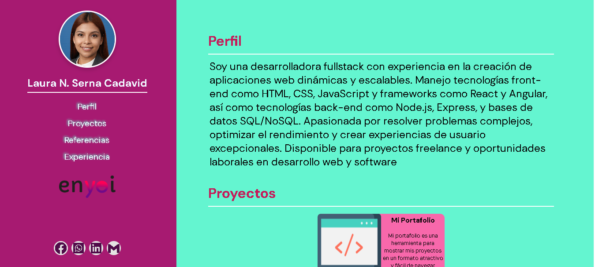

# 💼 Mi Portafolio Web - Laura Serna

<p align="center">
  
</p>

<p align="center">
  <b>Portafolio personal, responsivo y dinámico, hecho con HTML, CSS y JavaScript puro.</b>
  <br>
  Mi primer proyecto como desarrolladora full stack en formación.
</p>

<p align="center">
  <a href="https://hoja-de-vida-ashy.vercel.app/">
    
  </a>
</p>

<p align="center">
  
  
  
  
</p>

---

## 👩‍⚕️ Sobre mí

Soy **instrumentadora quirúrgica** en formación como **desarrolladora full stack**. Mi experiencia en quirófano me enseñó a trabajar con precisión, bajo presión y en equipo, y hoy llevo esa disciplina al desarrollo de software. Me interesa crear soluciones web, en especial para el sector salud.

Este portafolio es mi primer proyecto: aquí practiqué maquetación, diseño responsivo y manipulación del DOM.

---

## 🖼️ Vista previa

<!-- Agrega aquí una captura de pantalla de tu portafolio, por ejemplo:
<p align="center">
  
</p>
-->

---

## ✨ Características

- **📱 Diseño responsivo:** se adapta a celulares, tablets y computadores con Flexbox y media queries (puntos de quiebre en 768px y 480px). En pantallas pequeñas, la barra lateral fija pasa a ser una cabecera superior.
- **⚡ Contenido dinámico:** las secciones de *Proyectos*, *Referencias* y *Experiencias* se generan con JavaScript a partir de arreglos de objetos. Para agregar un proyecto nuevo basta con añadir un objeto, sin tocar el HTML.
- **🎨 Estilos organizados:** CSS separado por responsabilidad (global, barra lateral, contenido y responsivo) y paleta de colores definida con variables CSS.
- **🧭 Navegación suave:** desplazamiento animado entre secciones.
- **♿ Accesibilidad básica:** HTML semántico, textos alternativos en imágenes y etiquetas `aria-label` en los íconos de enlaces.

---

## 🛠️ Tecnologías

| Área | Herramientas |
|------|--------------|
| Estructura | HTML5 semántico |
| Estilos | CSS3, Flexbox, variables CSS, media queries |
| Lógica | JavaScript (ES6+), manipulación del DOM |
| Recursos | [Boxicons](https://boxicons.com/) (íconos), [Google Fonts](https://fonts.google.com/) (DM Sans) |
| Herramientas | Git, GitHub, Vercel |

---

## 📂 Estructura del proyecto

```text
miportafolio-enyoi/
├── assets/
│   └── img/                # Foto de perfil, logotipo y logos de tecnologías
├── scripts/
│   └── app.js              # Datos y renderizado dinámico de las secciones
├── styles/
│   ├── main.css            # Variables, tipografía y estilos globales
│   ├── left.css            # Barra lateral (perfil, menú y redes)
│   ├── right.css           # Contenido principal (tarjetas y secciones)
│   └── responsive.css      # Media queries para tablets y móviles
├── .hintrc                 # Configuración de Webhint
├── index.html              # Estructura principal
└── README.md
```

---

## 🚀 Cómo ejecutarlo localmente

1. Clona el repositorio:
   ```bash
   git clone https://github.com/lauraS527/miportafolio-enyoi.git
   ```
2. Entra a la carpeta:
   ```bash
   cd miportafolio-enyoi
   ```
3. Abre `index.html` en tu navegador, o usa la extensión **Live Server** de Visual Studio Code.

No necesita instalar dependencias.

---

## 📚 Lo que aprendí

- Estructurar un proyecto web en carpetas y archivos con una sola responsabilidad.
- Crear elementos del DOM con JavaScript y separar los datos de la lógica de renderizado.
- Construir un diseño responsivo con Flexbox y media queries.
- Publicar un sitio con despliegue continuo en Vercel y trabajar con Git y GitHub.

---

## 🔭 Próximos pasos

- [ ] Aprender React y migrar el portafolio a componentes.
- [ ] Aprender Node.js y Express para construir mi primer proyecto con backend y base de datos.
- [ ] Agregar más proyectos a la sección de Proyectos.
- [ ] Mejorar la accesibilidad y el rendimiento con Lighthouse.

---

## 📬 Contacto

¿Tienes una oportunidad laboral, un proyecto o quieres conversar sobre tecnología y salud? ¡Escríbeme!

- **Laura N. Serna Cadavid**
- **GitHub:** [lauraS527](https://github.com/lauraS527)
- **LinkedIn:** [Laura Serna](https://www.linkedin.com/in/laura-serna-93a471318/)
- **WhatsApp:** [Enviar mensaje](https://wa.link/t9wbd3)
- **Correo:** [nataliaserna0527@gmail.com](mailto:nataliaserna0527@gmail.com)

---

<p align="center">Diseñado y desarrollado con 💜 por Laura Serna</p>