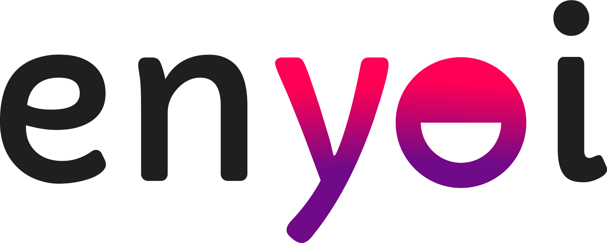

# 💼 Mi Portafolio Web - Laura Serna

<p align="center">
  
</p>

<p align="center">
  <b>Portafolio web personal e interactivo desarrollado con HTML5, CSS3 y JavaScript moderno (ES6+).</b>
  <br>
  Diseño responsivo enfocado en una experiencia de usuario fluida, limpia y dinámica.
</p>

<p align="center">
  <a href="https://lauras527.github.io/miportafolio-enyoi/">
    
  </a>
</p>

<p align="center">
  
  
  
  
</p>

---

## 🌟 Acerca del Proyecto

Este portafolio es mi carta de presentación como **Desarrolladora Fullstack**. Fue concebido no solo para exhibir mis proyectos, experiencias y referencias profesionales, sino también como una muestra práctica de maquetación avanzada, manipulación del DOM y arquitectura CSS modular.

### ✨ Características Principales

- **📱 100% Responsivo:** Adaptado meticulosamente para teléfonos móviles, tablets, laptops y pantallas de escritorio mediante Media Queries y Flexbox.
- **⚡ Carga Dinámica de Contenido:** Las secciones de *Proyectos*, *Referencias* y *Habilidades/Experiencias* se inyectan dinámicamente en el DOM a través de JavaScript, permitiendo escalabilidad y fácil mantenimiento.
- **🎨 Identidad Visual y Estilos Modernos:** Paleta de colores consistente mediante variables CSS (`:root`), tipografía personalizada con *Google Fonts (DM Sans)* y transiciones suaves.
- **🧭 Navegación Suave (Smooth Scroll):** Desplazamiento fluido entre secciones para una navegación cómoda e intuitiva.
- **🔗 Integración Social Directa:** Accesos directos a WhatsApp, LinkedIn, correo electrónico y proyectos desplegados.

---

## 🛠️ Tecnologías y Herramientas

- **Frontend:**
  - **HTML5:** Semántica web estructurada y accesible.
  - **CSS3:** Flexbox, variables CSS nativas, efectos hover y diseño responsivo sin frameworks externos.
  - **JavaScript (Vanilla ES6+):** Programación funcional, arrays de objetos, métodos de iteración (`forEach`) y manipulación del DOM.
- **Recursos Externos:**
  - [Boxicons](https://boxicons.com/) para iconografía vectorial.
  - [Google Fonts](https://fonts.google.com/) (DM Sans).
- **Control de Versiones y Despliegue:**
  - Git y GitHub para control de versiones.
  - GitHub Pages / Vercel para despliegue continuo.

---

## 📂 Estructura del Repositorio

```text
portfolio/
├── assets/
│   ├── fonts/
│   ├── icons/
│   └── img/
│       ├── cssLogo.png
│       ├── enyoi-logo-negro.png
│       └── laura-serna.png
├── scripts/
│   └── app.js             # Lógica JavaScript (render dinámico y eventos)
├── styles/
│   ├── main.css           # Estilos globales, variables y tipografía
│   ├── left.css           # Barra lateral fija (perfil, menú y redes)
│   ├── right.css          # Contenido principal (cards, experiencias)
│   └── responsive.css     # Media queries para móviles y tablets
├── index.html             # Estructura principal
└── README.md              # Documentación del proyecto
```

---

## 🚀 Cómo Ejecutar el Proyecto Localmente

Si deseas clonar y explorar este proyecto en tu máquina local:

1. **Clona este repositorio:**
   ```bash
   git clone https://github.com/lauraS527/miportafolio-enyoi.git
   ```
2. **Entra en la carpeta del proyecto:**
   ```bash
   cd miportafolio-enyoi
   ```
3. **Ábrelo en tu navegador:**
   - Puedes abrir directamente el archivo `index.html` en tu navegador preferido.
   - O usando la extensión **Live Server** en Visual Studio Code.

---

## 📬 Contacto

¿Tienes una oportunidad laboral, un proyecto freelance o una idea en mente? ¡Hablemos!

- **Desarrolladora:** Laura N. Serna Cadavid
- **LinkedIn:** [Laura Serna](https://www.linkedin.com/in/laura-serna-93a471318/)
- **WhatsApp:** [Enviar mensaje](https://wa.link/t9wbd3)
- **Email:** [nataliaserna0527@gmail.com](mailto:nataliaserna0527@gmail.com)

---
<p align="center">Diseñado y desarrollado con 💜 por Laura Serna</p>
